# Notify App

A simple, useful and stylish application where you can add your todos.

## Screens

<table>
  <tr>
    <td>Onboard</td>
    <td>Start</td>
    <td>Login</td>
    <td>Register</td>
  </tr>
  <tr>
     <td>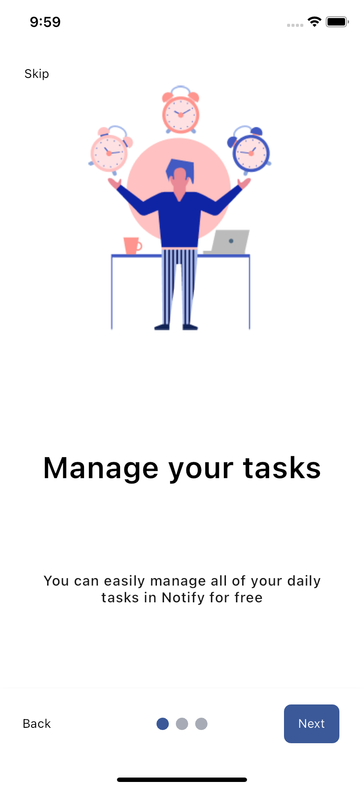</td>
     <td>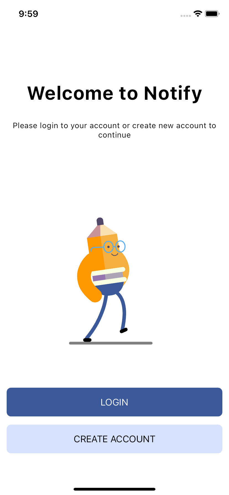</td>
     <td>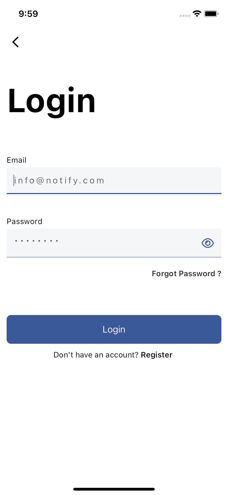</td>
     <td>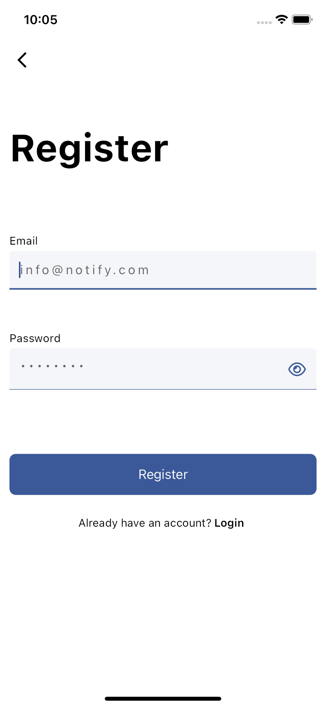</td>
  </tr>
  <tr>
    <td>Todo</td>
	<td>Todo</td>
    <td>Add Todo</td>
    <td>Filter Todo</td>
  </tr>
  <tr>
     <td>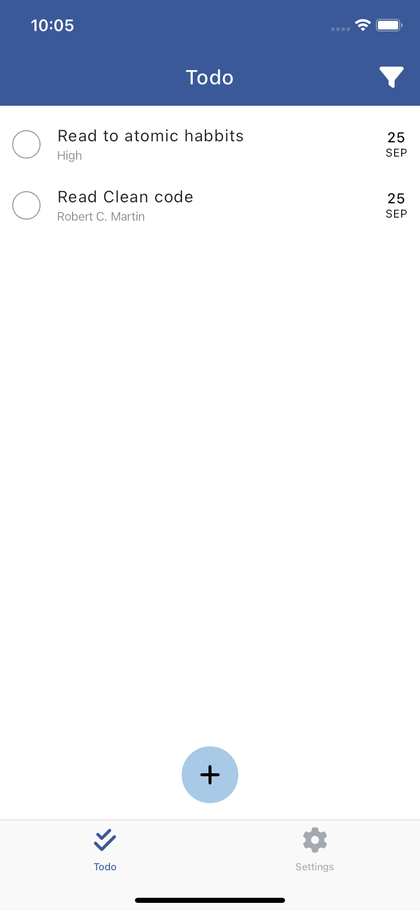</td>
     <td>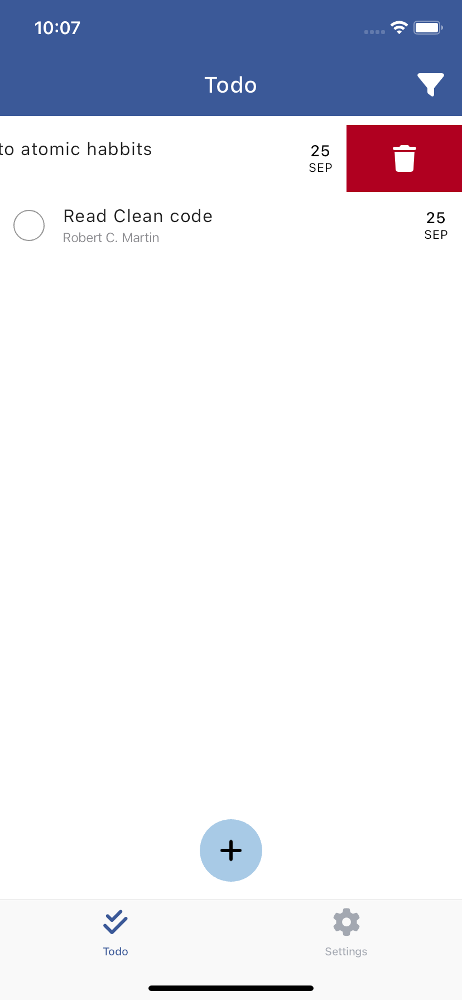</td>
	<td>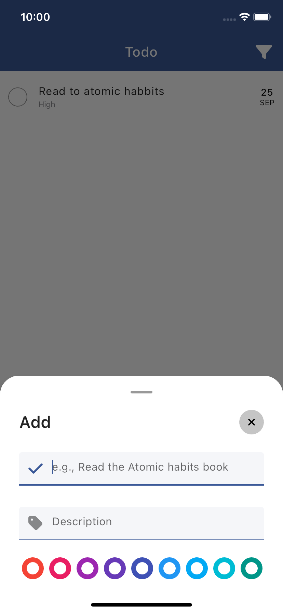</td>
     <td>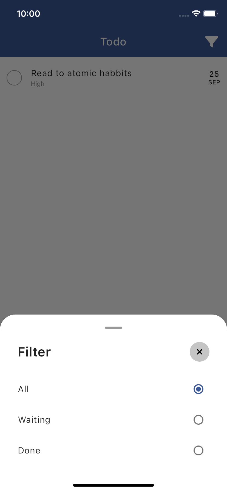</td>
  </tr>
    <tr>
    <td>Settings</td>
	<td>Language</td>
    <td>Theme</td>
    <td>Policy</td>
  </tr>
  <tr>
     <td>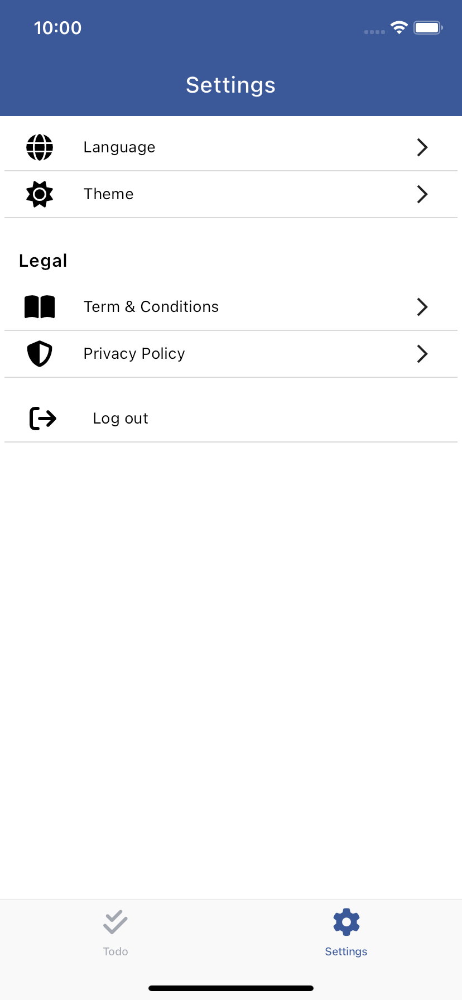</td>
     <td>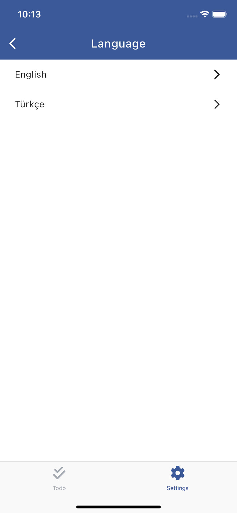</td>
	<td>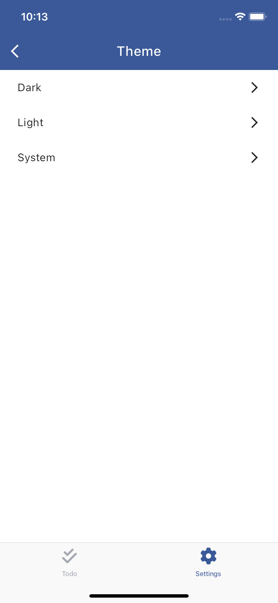</td>
     <td>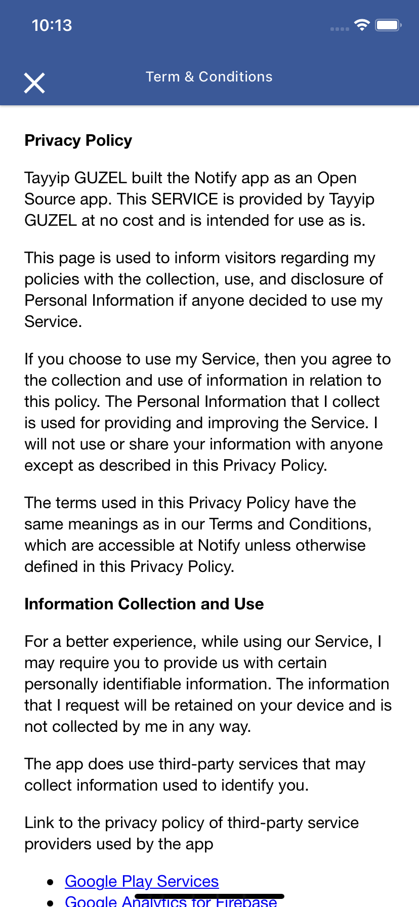</td>
  </tr>
</table>

## Built With

- [Flutter](https://flutter.dev/)
- [Dart](https://dart.dev/)
- [REST API](https://github.com/tyypgzl/notify-server)

## Packages
- State Management -> BLOC
- Route -> Auto Route
- Network -> Dio
- Localization -> Futter Localizations

## Config
- Flutter Version -> 3.13.4
